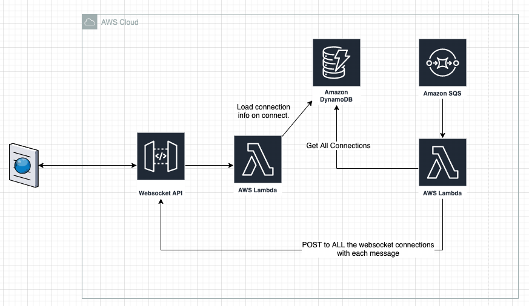
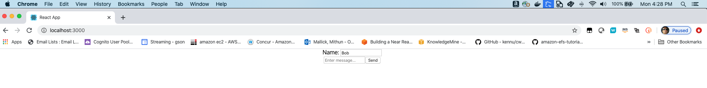

# simple-react-ws-sqs-chat-app

This is the code and template for a reach-chat-app using websockets. All the back end code is under the backend directory.There are three functions contained within the directories and a SAM template that wires them up to a DynamoDB table and provides the minimal set of permissions needed to run the app. The fourth function is used to get messages from a SQS queue and broadcast the message in it to all the connnected chat clients:

```
.
├── README.md                   <-- This instructions file
├── onconnect                   <-- Source code onconnect
├── ondisconnect                <-- Source code ondisconnect
├── sendmessage                 <-- Source code sendmessage
├── onsqsmessage                <-- Source code onsqsmessage
└── template.yaml               <-- SAM template for Lambda Functions and DDB
```

# Deploying to your account

Architecture for the solution is described in the following diagram.


## Back end services

You can use the following SAM commands to deploy the back end services to your account. It includes lambda functions, DynamoDB table, SQS queue,API Gateway endpoint and all the required permissions.

### AWS CLI commands

You can install the [AWS SAM CLI](https://docs.aws.amazon.com/serverless-application-model/latest/developerguide/serverless-sam-cli-install.html) and use it to package, deploy, and describe your application. These are the commands you'll need to use:

```
cd backend

sam build

sam deploy \
    --stack-name react-sqs-chat-app \
    --capabilities CAPABILITY_IAM \
    --region $AWS_REGION \
    --guided

cd ..

```

Answer the queuestions for any changes to the guided deploy or accept the defaults.

```
aws cloudformation describe-stacks \
    --stack-name react-sqs-chat-app --query 'Stacks[].Outputs'
```

Note down the WebSocketURI and SQSURL parameter. Both of the parameters will be used for testing the front end web app.

## Front end deployment

The front end code is based on react app. Once, the back end services have been deployed. Perform the following steps.

1. Open Chat.js under frontend/wsdemo/ws-sqs-chat-app/src and replace the REPLACE_WITH_WebSocketURI variable value to the WebSocketURI output value that was generated by back end service deployment. Save the file.

1. Run following command to launch the web app.

```bash
cd frontend/wsdemo/ws-sqs-chat-app

npm start

```

The last command would launch a browser window with a text box to enter messages.

## Testing the chat API

To test the websocket API, we will test two scenarios. The first one will be sending chat messages using the web app. Second will be sending a message to a SQS queue and broadcasting it to all the connected websocket clients.

### Web app chat using websocket

1. Open multiple browser windows with the url http://localhost:3000/
1. Enter a differnt name for the sender on each of the messages and enter some test messages. The messages should show up in all the windows. The page should look like as below:



### Broadcast message from SQS queue

1. In the terminal window run the following command to send a message to SQS queue. The message should show up in all the chat client windos.

```
aws sqs send-message --queue-url REPLACE_WTH_SQSURL --message-body "Test message for SQS Websocket chat app"

```
